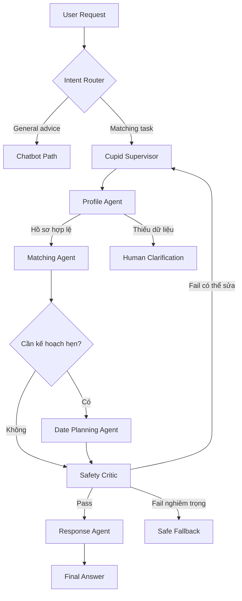
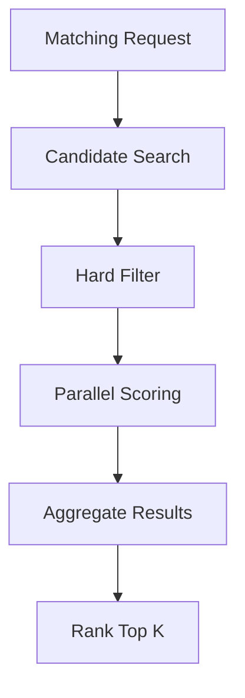

# CupidMAS — Multi-Agent Workflow

## Safety-Aware Supervisor-Based Multi-Agent System for Cupid Agent

> **Project:** Cupid Agent — Trợ lý ghép đôi và phân tích độ tương thích  
> **Architecture:** Supervisor-based Multi-Agent System  
> **Agent pattern:** ReAct V1 → Plan-and-ReAct Multi-Agent V2  
> **Core stack:** Python, LangChain, LangGraph, Langfuse, Pydantic  

---

## 1. Mục tiêu kiến trúc

CupidMAS mở rộng Cupid ReAct Agent thành một hệ thống Multi-Agent có khả năng:

- Hiểu mục tiêu tổng thể của người dùng.
- Lập kế hoạch nhiều bước.
- Giao nhiệm vụ cho các Specialist Agent.
- Gọi Tool và thu thập Observation.
- Chạy tính điểm compatibility theo cách deterministic.
- Kiểm tra consent, privacy và các điều kiện an toàn.
- Phản tư trên kết quả và tái lập kế hoạch khi cần.
- Tổng hợp câu trả lời có grounding và giải thích được.

Hệ thống vẫn giữ đúng bản chất ReAct:

```text
Thought → Action → Observation → Thought → ... → Final Answer
```

Trong Agent V2, vòng lặp được mở rộng thành:

```text
Think → Plan → Delegate → Operate → Observe → Reflect
                    ↑                            ↓
                    └──────── Replan ────────────┘
```

> `Thought` hoặc `Thinking` trong Trace chỉ là bản tóm tắt quyết định có thể công khai, không phải toàn bộ chain-of-thought nội bộ của mô hình.

---

## 2. Nguyên tắc thiết kế

### 2.1. Supervisor điều phối, Specialist thực thi

Supervisor hiểu mục tiêu, lập kế hoạch và giao việc nhưng không trực tiếp:

- Truy xuất database.
- Tính compatibility.
- Tự thay đổi dữ liệu.
- Bỏ qua Safety Gate.

Các thao tác này được giao cho Specialist Agent hoặc deterministic service.

### 2.2. Tool không đồng nghĩa với Agent

- **Agent:** có mục tiêu, state, khả năng quyết định và local ReAct Loop.
- **Tool:** callable deterministic phục vụ một hành động cụ thể.
- **Node:** một bước bắt buộc trong workflow, không nhất thiết do LLM quyết định.

Ví dụ:

| Thành phần | Loại |
|---|---|
| Cupid Supervisor | Agent |
| Matching Agent | Agent/Subgraph |
| `search_candidates` | Tool |
| `calculate_compatibility` | Tool |
| Consent Gate | Deterministic Node |
| Rank Top K | Deterministic Node |

### 2.3. Giao tiếp bằng shared state

Các Agent không gửi hội thoại tự do trực tiếp cho nhau. Mọi kết quả được trả về shared state theo schema thống nhất để:

- Dễ kiểm thử.
- Dễ trace.
- Không làm mất dữ liệu.
- Theo dõi được nguồn evidence.
- Hạn chế hallucination giữa các Agent.

### 2.4. LLM không tự sinh compatibility score

Điểm compatibility phải được tính bằng code. LLM chỉ:

- Hiểu yêu cầu.
- Lập kế hoạch.
- Chọn Tool.
- Diễn giải kết quả.

---

## 3. Thành phần Multi-Agent System

Hệ thống gồm sáu Agent chính:

| Agent | Trách nhiệm |
|---|---|
| **Cupid Supervisor Agent** | Thinking, Planning, Delegation, Reflection và Replanning |
| **Profile Agent** | Truy xuất hồ sơ, kiểm tra consent, completeness và eligibility |
| **Matching Agent** | Tìm candidate, tính compatibility, aggregate và xếp hạng |
| **Date Planning Agent** | Đề xuất buổi hẹn theo sở thích, địa điểm và ngân sách |
| **Safety Critic Agent** | Kiểm tra privacy, grounding, safety và policy |
| **Response Agent** | Tổng hợp evidence thành Final Answer |

Không phải Agent nào cũng cần ReAct Loop:

- Supervisor Agent: global Plan-and-ReAct.
- Profile Agent: local ReAct với Profile Tool.
- Matching Agent: local ReAct với Matching Tool.
- Date Planning Agent: local ReAct với Date Tool.
- Safety Critic Agent: structured review, có quyền veto.
- Response Agent: structured generation, không truy cập dữ liệu trực tiếp.

---

## 4. Workflow tổng thể



### 4.1. Các luồng chính

#### General Advice

```text
User
→ Intent Router
→ Chatbot Path
→ Final Answer
```

Không khởi tạo toàn bộ Multi-Agent System cho các câu hỏi lý thuyết đơn giản.

#### Pair Analysis

```text
User
→ Supervisor
→ Profile Agent
→ Matching Agent
→ Safety Critic
→ Response Agent
→ Final Answer
```

#### Match Discovery

```text
User
→ Supervisor
→ Profile Agent
→ Matching Agent
    → Search Candidates
    → Parallel Scoring
    → Aggregate
    → Rank Top K
→ Safety Critic
→ Response Agent
```

#### Match and Date Planning

```text
User
→ Supervisor
→ Profile Agent
→ Matching Agent
→ Date Planning Agent
→ Safety Critic
→ Response Agent
```

---

## 5. Cupid Supervisor Agent

Supervisor là trung tâm điều phối của hệ thống.

### 5.1. Trách nhiệm

- Phân loại intent.
- Xác định goal.
- Đánh giá dữ liệu cần thiết.
- Tạo global plan.
- Kiểm tra dependency giữa các task.
- Chọn Specialist Agent.
- Nhận Observation.
- Đánh giá tiến độ.
- Replan khi task thất bại.
- Kết thúc khi goal đã hoàn thành.

### 5.2. Input

```json
{
  "user_id": "U001",
  "query": "Tìm ba người phù hợp nhất và lên kế hoạch buổi hẹn cho người đứng đầu."
}
```

### 5.3. Thinking output

```json
{
  "intent": "find_matches_and_plan_date",
  "goal": "Tìm top 3 match và tạo date plan cho top 1",
  "risk_level": "medium",
  "required_information": [
    "requester_profile",
    "eligible_candidates",
    "compatibility_scores",
    "shared_interests",
    "date_budget"
  ],
  "reason_summary": "Cần xác minh hồ sơ, tìm ứng viên, chấm điểm, kiểm tra an toàn và lập kế hoạch hẹn."
}
```

### 5.4. Global plan

```json
{
  "tasks": [
    {
      "task_id": "T1",
      "agent": "profile_agent",
      "description": "Đọc và xác minh hồ sơ U001",
      "dependencies": []
    },
    {
      "task_id": "T2",
      "agent": "matching_agent",
      "description": "Tìm và xếp hạng các ứng viên",
      "dependencies": ["T1"]
    },
    {
      "task_id": "T3",
      "agent": "date_planning_agent",
      "description": "Lập kế hoạch hẹn cho top 1",
      "dependencies": ["T2"]
    },
    {
      "task_id": "T4",
      "agent": "safety_critic_agent",
      "description": "Kiểm tra tính an toàn và grounding",
      "dependencies": ["T2", "T3"]
    },
    {
      "task_id": "T5",
      "agent": "response_agent",
      "description": "Tổng hợp câu trả lời cuối cùng",
      "dependencies": ["T4"]
    }
  ]
}
```

### 5.5. Supervisor loop

```text
Think
→ Create/Update Plan
→ Select Ready Task
→ Delegate
→ Receive Agent Result
→ Update Shared State
→ Reflect
→ Continue / Replan / Ask Human / Fallback / Finish
```

Supervisor chỉ chạy task khi toàn bộ `dependencies` đã hoàn thành.

---

## 6. Profile Agent

### 6.1. Mục tiêu

Đảm bảo requester và target profile có thể tham gia matching một cách hợp lệ.

### 6.2. Tool whitelist

```text
get_match_profile
check_profile_completeness
check_matching_eligibility
```

### 6.3. Local ReAct example

```text
Thought:
Cần tải hồ sơ U001.

Action:
get_match_profile(user_id="U001")

Observation:
Profile tồn tại, matching_consent=true.

Thought:
Cần kiểm tra hồ sơ có đủ dữ liệu không.

Action:
check_profile_completeness(user_id="U001")

Observation:
Hồ sơ đầy đủ 90%, thiếu trường date_budget.

Thought:
Cần kiểm tra điều kiện ghép đôi.

Action:
check_matching_eligibility(user_id="U001")

Observation:
eligible=true, age>=18, active=true.

Final:
Hồ sơ đủ điều kiện matching, nhưng cần hỏi budget nếu lập date plan.
```

### 6.4. Output

```json
{
  "task_id": "T1",
  "agent": "profile_agent",
  "status": "completed",
  "result": {
    "eligible": true,
    "profile_complete": true,
    "missing_optional_fields": ["date_budget"]
  },
  "evidence": [
    "matching_consent=true",
    "age>=18",
    "active=true"
  ],
  "errors": [],
  "recommendation": "continue"
}
```

Nếu thiếu dữ liệu bắt buộc:

```json
{
  "status": "blocked",
  "recommendation": "ask_human"
}
```

---

## 7. Matching Agent

Matching Agent là một subgraph riêng.

### 7.1. Mục tiêu

- Tìm candidate.
- Áp dụng hard filter.
- Tính compatibility.
- Aggregate kết quả.
- Xếp hạng Top K.

### 7.2. Matching subgraph



### 7.3. Tool whitelist

```text
search_candidates
calculate_compatibility
get_compatibility_breakdown
```

### 7.4. Hard filter

Hard filter được chạy trước compatibility scoring:

- Cả hai từ 18 tuổi.
- Hai hồ sơ đang active.
- Hai bên đã bật matching consent.
- Không nằm trong block list.
- Thỏa điều kiện tuổi của cả hai.
- Không vi phạm deal-breaker bắt buộc.

Hard constraint không được nới lỏng khi Replan.

### 7.5. Parallel scoring

Sau khi tìm được candidate:

```text
U002 → calculate_compatibility
U003 → calculate_compatibility
U005 → calculate_compatibility
U007 → calculate_compatibility
U009 → calculate_compatibility
```

Các compatibility task được fan-out chạy song song. Sau đó reducer aggregate và xếp hạng kết quả.

### 7.6. Compatibility output

```json
{
  "candidate_id": "U003",
  "eligible": true,
  "score": 86,
  "confidence": 92,
  "breakdown": {
    "relationship_goal": 100,
    "values": 90,
    "lifestyle": 75,
    "communication_style": 80,
    "interests": 70,
    "logistics": 100
  },
  "strengths": [
    "Cùng định hướng mối quan hệ lâu dài",
    "Tương đồng về giá trị sống"
  ],
  "potential_conflicts": [
    "Khác biệt về mức độ giao tiếp xã hội"
  ]
}
```

### 7.7. Agent output

```json
{
  "task_id": "T2",
  "agent": "matching_agent",
  "status": "completed",
  "result": {
    "ranked_matches": [
      {
        "candidate_id": "U003",
        "score": 86,
        "confidence": 92
      },
      {
        "candidate_id": "U005",
        "score": 81,
        "confidence": 88
      },
      {
        "candidate_id": "U002",
        "score": 76,
        "confidence": 95
      }
    ]
  },
  "evidence": [
    "5 candidates retrieved",
    "5 candidates passed hard filters",
    "5 compatibility calculations completed"
  ],
  "errors": [],
  "recommendation": "continue"
}
```

---

## 8. Date Planning Agent

Date Planning Agent chỉ chạy khi người dùng yêu cầu.

### 8.1. Tool whitelist

```text
get_shared_interests
search_date_activities
estimate_date_cost
```

### 8.2. Local dataset

MVP có thể dùng dữ liệu giả lập:

```json
{
  "activity_id": "A01",
  "name": "Workshop làm gốm",
  "city": "Hanoi",
  "interests": ["art", "creative"],
  "estimated_cost": 400000,
  "indoor": true
}
```

### 8.3. Local ReAct example

```text
Thought:
Cần tìm sở thích chung giữa U001 và U003.

Action:
get_shared_interests(user_a_id="U001", user_b_id="U003")

Observation:
photography, coffee, art.

Thought:
Cần tìm hoạt động phù hợp tại Hà Nội dưới 500.000 đồng.

Action:
search_date_activities(
    city="Hanoi",
    interests=["photography", "coffee", "art"],
    max_budget=500000
)

Observation:
Workshop làm gốm: 400.000 đồng.
Cafe triển lãm ảnh: 250.000 đồng.

Thought:
Cần kiểm tra tổng chi phí.

Action:
estimate_date_cost(activity_id="A01", people=2)

Observation:
Tổng chi phí dự kiến: 400.000 đồng.

Final:
Đề xuất workshop làm gốm cho hai người.
```

Date Planning Agent chỉ đề xuất. Nếu bổ sung Tool đặt lịch hoặc đặt chỗ, hệ thống phải yêu cầu người dùng xác nhận trước khi thực thi.

---

## 9. Safety Critic Agent

Safety Critic có quyền:

- `PASS`: kết quả an toàn, chuyển sang Response Agent.
- `REVISE`: yêu cầu Supervisor sửa tối đa số lần cho phép.
- `BLOCK`: dừng và trả Safe Fallback.

### 9.1. Checklist

- Hai bên có từ 18 tuổi không.
- Có matching consent không.
- Có tiết lộ PII không.
- Có sử dụng thuộc tính nhạy cảm ngoài phạm vi cho phép không.
- Compatibility score có đến từ Tool không.
- Explanation có grounded vào Observation không.
- Có phát ngôn tuyệt đối như “chắc chắn phù hợp” không.
- Date plan có nằm trong budget không.
- Có bỏ qua hard constraint hoặc deal-breaker không.
- Có sử dụng dữ liệu chưa được người dùng cung cấp không.

### 9.2. Output example

```json
{
  "task_id": "T4",
  "agent": "safety_critic_agent",
  "status": "completed",
  "verdict": "revise",
  "violations": [
    {
      "type": "ungrounded_claim",
      "message": "Câu trả lời mô tả hai người chắc chắn phù hợp lâu dài."
    }
  ],
  "revision_instruction": "Thay bằng mức tương thích ước tính và nêu giới hạn dữ liệu.",
  "recommendation": "replan"
}
```

### 9.3. Routing

```text
PASS
→ Response Agent

REVISE
→ Supervisor cập nhật task và chạy lại

BLOCK
→ Safe Fallback
```

---

## 10. Response Agent

Response Agent chỉ nhận dữ liệu đã được Agent khác kiểm tra.

Nó không được:

- Tự gọi lại database.
- Sửa compatibility score.
- Tạo candidate mới.
- Bỏ qua Safety Report.
- Bịa thông tin ngoài Observation.

### 10.1. Input

- Ranked matches.
- Compatibility breakdown.
- Date plan.
- Safety verdict.
- Evidence references.
- Limitations.

### 10.2. Output schema

```json
{
  "summary": "Đã tìm thấy ba hồ sơ phù hợp nhất.",
  "matches": [
    {
      "candidate_id": "U003",
      "compatibility_score": 86,
      "confidence": 92,
      "strengths": [
        "Cùng định hướng mối quan hệ lâu dài",
        "Tương đồng về giá trị sống"
      ],
      "potential_conflicts": [
        "Khác biệt về mức độ giao tiếp xã hội"
      ]
    }
  ],
  "date_plan": {
    "activity": "Workshop làm gốm",
    "estimated_cost": 400000
  },
  "limitations": [
    "Điểm số là ước tính từ dữ liệu hồ sơ đã cung cấp",
    "Kết quả không bảo đảm mức độ phù hợp thực tế"
  ]
}
```

---

## 11. Shared State

```python
from typing import Literal
from typing_extensions import TypedDict
from langgraph.graph import MessagesState


class PlanTask(TypedDict):
    task_id: str
    agent: str
    description: str
    dependencies: list[str]
    status: Literal[
        "pending",
        "running",
        "completed",
        "blocked",
        "failed",
    ]


class CupidMultiAgentState(MessagesState):
    requester_id: str
    query: str

    intent: str | None
    goal: str | None
    reason_summary: str | None
    risk_level: Literal["low", "medium", "high"]

    global_plan: list[PlanTask]
    completed_tasks: list[str]
    current_task_id: str | None

    requester_profile: dict | None
    profile_report: dict | None

    candidates: list[dict]
    compatibility_results: list[dict]
    ranked_matches: list[dict]

    date_plan: dict | None
    safety_report: dict | None

    agent_observations: list[dict]
    agent_errors: list[dict]
    executed_actions: list[dict]

    delegation_count: int
    replan_count: int
    tool_calls_count: int
    critic_revision_count: int

    final_answer: dict | None

    status: Literal[
        "thinking",
        "planning",
        "delegating",
        "operating",
        "observing",
        "reflecting",
        "waiting_human",
        "ready_for_review",
        "ready_to_answer",
        "completed",
        "failed",
    ]
```

---

## 12. Giao thức trao đổi giữa các Agent

Mọi Specialist Agent trả cùng một envelope:

```json
{
  "task_id": "T2",
  "agent": "matching_agent",
  "status": "completed",
  "result": {},
  "evidence": [],
  "errors": [],
  "recommendation": "continue"
}
```

`recommendation` chỉ nhận một trong các giá trị:

```text
continue
ask_human
replan
safe_fallback
finish
```

### Quy tắc

- `result` chứa dữ liệu có cấu trúc.
- `evidence` ghi nguồn của kết luận.
- `errors` không được ẩn lỗi Tool.
- Specialist Agent không tự chọn Agent tiếp theo.
- Supervisor là thành phần duy nhất quyết định delegation toàn cục.

---

## 13. Replanning Workflow

Ví dụ Matching Agent chỉ tìm được một candidate trong khi người dùng yêu cầu Top 3:

```text
Matching Agent
→ Observation: chỉ tìm thấy một candidate

Supervisor Reflection
→ Mục tiêu Top 3 chưa đạt

Supervisor Replan
→ Nới lỏng soft filter về city
→ Giữ nguyên age gate, consent, block list và deal-breaker

Matching Agent chạy lại
→ Tìm được ba candidate

Safety Critic
→ Kiểm tra kế hoạch mới

Response Agent
→ Final Answer
```

### Hard constraint

Không được thay đổi khi Replan:

- Tuổi tối thiểu.
- Consent.
- Block list.
- Safety policy.
- Deal-breaker bắt buộc.

### Soft constraint

Có thể nới lỏng trong phạm vi cho phép:

- Thành phố.
- Khoảng cách.
- Sở thích phụ.
- Khoảng ngân sách nếu được hỏi lại người dùng.

---

## 14. Human-in-the-loop

Hệ thống phải tạm dừng để hỏi người dùng khi:

- Thiếu dữ liệu bắt buộc.
- Muốn nới lỏng một preference quan trọng.
- Muốn lưu feedback.
- Muốn thực hiện hành động có side effect.
- Muốn đặt lịch hoặc đặt chỗ.

Ví dụ:

```text
Hệ thống chưa có ngân sách cho buổi hẹn.
Bạn muốn chọn mức nào?

1. Dưới 300.000 đồng
2. 300.000–500.000 đồng
3. Trên 500.000 đồng
```

LangGraph `interrupt()` có thể tạm dừng graph và tiếp tục sau khi nhận câu trả lời, với điều kiện graph được compile cùng checkpointer.

---

## 15. Guardrails và điều kiện dừng

```python
MAX_GLOBAL_TASKS = 10
MAX_DELEGATIONS = 12
MAX_REPLANS = 2
MAX_LOCAL_TOOL_CALLS = 4
MAX_CANDIDATES_TO_SCORE = 5
MAX_CRITIC_REVISIONS = 2
GRAPH_RECURSION_LIMIT = 30
TOOL_TIMEOUT_SECONDS = 10
```

Hệ thống dừng khi:

- Goal đã hoàn thành.
- Safety Critic trả `BLOCK`.
- Vượt replan budget.
- Vượt delegation budget.
- Vượt local tool budget.
- Có cùng Agent + Task + Input bị lặp.
- Human không cung cấp dữ liệu bắt buộc.
- Không còn hướng phục hồi hợp lệ.
- Tool liên tục thất bại.
- Graph đạt recursion limit.

Safe Fallback example:

```text
Hiện tại tôi chưa thể hoàn thành yêu cầu vì dữ liệu hồ sơ chưa đủ
hoặc không tìm thấy ứng viên đáp ứng các điều kiện bắt buộc.
Tôi chưa thay đổi bất kỳ dữ liệu hay preference nào của bạn.
```

---

## 16. LangGraph Implementation

### 16.1. Top-level graph

```text
START
→ intent_router
→ supervisor
→ specialist_dispatcher
→ specialist_subgraph
→ supervisor_reflection
→ safety_critic
→ response_agent
→ END
```

### 16.2. Routing example

```python
def route_supervisor(state: CupidMultiAgentState) -> str:
    if state["status"] == "waiting_human":
        return "human_clarification"

    if state["status"] == "need_profile":
        return "profile_agent"

    if state["status"] == "need_matching":
        return "matching_agent"

    if state["status"] == "need_date_plan":
        return "date_planning_agent"

    if state["status"] == "ready_for_review":
        return "safety_critic"

    if state["status"] == "ready_to_answer":
        return "response_agent"

    return "safe_fallback"
```

### 16.3. Specialist subgraphs

Các Agent có Tool nên được triển khai thành subgraph:

```text
Profile Subgraph
Matching Subgraph
Date Planning Subgraph
```

Mỗi subgraph có:

- Local messages.
- Tool whitelist.
- Local tool budget.
- Local termination.
- Structured output.

Supervisor graph chỉ quản lý global state, dependency và delegation.

---

## 17. Tech Stack

| Layer | Công nghệ | Vai trò |
|---|---|---|
| Language | Python 3.11+ | Ngôn ngữ chính |
| LLM abstraction | LangChain | Model, Tool, Prompt và Structured Output |
| Orchestration | LangGraph | State, Subgraph, Routing, Loop và Interrupt |
| Observability | Langfuse | Trace, Dataset, Scores và Evaluation |
| Schema | Pydantic v2 | Validate State, Plan, Tool Input/Output |
| Model provider | Gemini hoặc OpenAI | Thinking summary, Planning, Tool selection |
| Local data | JSON + SQLite | Synthetic profile, activity và feedback |
| UI | Streamlit | Demo chat và match result |
| API | FastAPI, optional | Tách Agent service khỏi UI |
| Test | pytest | Unit, integration và route testing |
| Configuration | python-dotenv | API key và environment |
| Deployment | Docker | Môi trường chạy đồng nhất |
| CI | GitHub Actions | Test và secret check |

Dependencies đề xuất:

```txt
langchain>=1.1,<2
langgraph>=1,<2
langfuse>=3,<4
pydantic>=2,<3
python-dotenv
streamlit
pytest
```

Nếu dùng Gemini:

```txt
langchain-google-genai
```

Nếu dùng OpenAI:

```txt
langchain-openai
```

---

## 18. Cấu trúc mã nguồn

```text
src/
├── app.py
├── providers.py
├── multi_agent/
│   ├── state.py
│   ├── supervisor.py
│   ├── dispatcher.py
│   ├── reflection.py
│   ├── routes.py
│   └── builder.py
├── agents/
│   ├── profile_agent.py
│   ├── matching_agent.py
│   ├── date_planning_agent.py
│   ├── safety_critic_agent.py
│   └── response_agent.py
├── subgraphs/
│   ├── profile_graph.py
│   ├── matching_graph.py
│   └── date_planning_graph.py
├── tools/
│   ├── profile_tools.py
│   ├── matching_tools.py
│   └── date_tools.py
├── services/
│   ├── compatibility_scoring.py
│   ├── candidate_filtering.py
│   ├── ranking.py
│   └── privacy_guard.py
├── schemas/
│   ├── profile.py
│   ├── plan.py
│   ├── agent_result.py
│   └── compatibility.py
└── observability/
    └── langfuse_config.py
```

Tests:

```text
tests/
├── test_profile_tools.py
├── test_candidate_filtering.py
├── test_compatibility_scoring.py
├── test_profile_agent.py
├── test_matching_agent.py
├── test_supervisor_plan.py
├── test_replanning.py
├── test_graph_routes.py
├── test_safety_critic.py
└── test_privacy_guard.py
```

---

## 19. Langfuse Observability

Mỗi user request tương ứng với một Langfuse trace.

```text
Trace: cupid-multi-agent-run
├── Intent Router
├── Supervisor: Thinking
├── Supervisor: Planning
├── Profile Agent
│   ├── get_match_profile
│   ├── check_profile_completeness
│   └── check_matching_eligibility
├── Matching Agent
│   ├── search_candidates
│   ├── score U002
│   ├── score U003
│   └── score U005
├── Date Planning Agent
├── Safety Critic
├── Supervisor: Reflection
└── Response Agent
```

Metadata:

```json
{
  "agent_version": "v2-multi-agent",
  "intent": "find_matches_and_plan_date",
  "replan_count": 0,
  "delegation_count": 5,
  "tool_calls_count": 9,
  "safety_verdict": "pass"
}
```

Không ghi các dữ liệu sau lên Langfuse:

- Số điện thoại.
- Email.
- Địa chỉ cụ thể.
- Tin nhắn riêng tư.
- Profile thật chưa được ẩn danh.
- Thuộc tính nhạy cảm không cần thiết.

---

## 20. Evaluation Metrics

### 20.1. Supervisor

| Metric | Ý nghĩa |
|---|---|
| `intent_correct` | Phân loại đúng yêu cầu |
| `plan_validity` | Plan có đủ bước cần thiết |
| `dependency_correct` | Dependency giữa task hợp lệ |
| `delegation_correct` | Giao đúng Specialist Agent |
| `goal_completion` | Hoàn thành mục tiêu tổng thể |

### 20.2. Specialist Agent

| Metric | Ý nghĩa |
|---|---|
| `tool_sequence_correct` | Gọi Tool đúng thứ tự |
| `tool_success_rate` | Tỷ lệ Tool thành công |
| `grounded_result` | Kết quả dựa trên Observation |
| `local_termination` | Subgraph dừng đúng |

### 20.3. Reflection và Safety

| Metric | Ý nghĩa |
|---|---|
| `replan_success` | Replan có phục hồi được không |
| `repeated_action_count` | Số hành động bị lặp |
| `hard_filter_respected` | Có giữ hard constraint không |
| `privacy_safe` | Không lộ PII |
| `safe_termination` | Dừng an toàn |

### 20.4. Toàn hệ thống

| Metric | Ý nghĩa |
|---|---|
| `plan_completion_rate` | Tỷ lệ task hoàn thành |
| `grounded_explanation` | Final Answer có evidence |
| `helpfulness` | Mức hữu ích của phản hồi |
| `latency` | Thời gian hoàn thành |
| `token_cost` | Chi phí model |

---

## 21. Test Scenario cho Multi-Agent V2

### User request

```text
Tìm ba người phù hợp nhất với U001.
So sánh kỹ hai người đứng đầu.
Sau đó gợi ý một buổi hẹn phù hợp với sở thích chung,
ngân sách dưới 500.000 đồng tại Hà Nội.
```

### Expected global plan

1. Tải hồ sơ U001.
2. Kiểm tra consent và profile completeness.
3. Tìm candidate.
4. Áp dụng hard filter.
5. Tính compatibility song song.
6. Chọn Top 3.
7. So sánh Top 2.
8. Lập date plan cho Top 1.
9. Safety review.
10. Tổng hợp Final Answer.

### Expected recovery

Nếu Date Tool thất bại:

```text
Observation:
Date Tool Error.

Reflection:
Bước lập địa điểm hẹn thất bại nhưng đã có sở thích chung.

Replan:
Chuyển sang đề xuất loại hoạt động chung,
không khẳng định địa điểm hoặc giá cụ thể.

Final Answer:
Trả kết quả matching và nêu rõ giới hạn dữ liệu date plan.
```

---

## 22. Phân công nhóm 6 người

| Role | Phần phụ trách |
|---|---|
| Role 1 | Profile schema, user story, test case và expected behavior |
| Role 2 | Profile Tool, Matching Tool và Date Tool |
| Role 3 | Supervisor, Specialist và Safety Prompt |
| Role 4 | LangGraph State, Subgraph, Dispatcher và Integration |
| Role 5 | Langfuse Trace, Dataset, Score và Evaluation |
| Role 6 | Streamlit UI, Cross-Audit, Privacy QA và Demo |

---

## 23. Lộ trình triển khai

### Phase 1 — Baseline

- Chatbot Baseline.
- Không gọi Tool.
- Chạy trên bộ test chung.

### Phase 2 — Single ReAct Agent V1

- Một ReAct Agent.
- Profile, Candidate và Compatibility Tool.
- `Thought → Action → Observation`.
- Guardrail và Trace.

### Phase 3 — Multi-Agent V2 Core

- Cupid Supervisor.
- Profile Agent.
- Matching Agent.
- Safety Critic.
- Response Agent.
- Shared state và agent result envelope.

### Phase 4 — Planning and Reflection

- Structured Global Plan.
- Dependency tracking.
- Supervisor Reflection.
- Replanning.
- Tool và delegation budget.

### Phase 5 — Extended Operation

- Date Planning Agent.
- Parallel compatibility scoring.
- Human-in-the-loop.
- Memory/checkpoint.

### Phase 6 — Evaluation

- Langfuse Dataset.
- Baseline vs ReAct V1 vs Multi-Agent V2.
- Code evaluator cho Tool, Route và Safety.
- Báo cáo latency, token và success rate.

---

## 24. Definition of Done

Multi-Agent V2 được xem là hoàn thành khi:

- [ ] General advice đi qua Chatbot Path.
- [ ] Matching request đi qua Supervisor.
- [ ] Supervisor tạo được plan có dependency.
- [ ] Profile Agent kiểm tra consent và eligibility.
- [ ] Matching Agent tìm và chấm nhiều candidate.
- [ ] Compatibility score được tính deterministic.
- [ ] Candidate scoring có thể chạy song song.
- [ ] Safety Critic có thể `PASS`, `REVISE` hoặc `BLOCK`.
- [ ] Supervisor có thể Replan tối đa số lần cho phép.
- [ ] Không nới lỏng hard constraint.
- [ ] Response Agent chỉ sử dụng evidence đã được cung cấp.
- [ ] Hệ thống không tiết lộ PII.
- [ ] Có Safe Fallback.
- [ ] Có Langfuse trace cho từng Agent và Tool.
- [ ] Có ít nhất một success trace và một recovery trace.
- [ ] Có so sánh Chatbot, ReAct V1 và Multi-Agent V2.

---

## 25. Tên kiến trúc đề xuất

> **CupidMAS: A Safety-Aware Supervisor-Based Multi-Agent System with Plan-and-ReAct Matching, Parallel Compatibility Analysis, and Reflective Replanning.**

---

## 26. Tài liệu tham khảo kỹ thuật

- [LangGraph Graph API](https://docs.langchain.com/oss/python/langgraph/graph-api)
- [LangGraph Workflows and Agents](https://docs.langchain.com/oss/python/langgraph/workflows-agents)
- [LangGraph Persistence](https://docs.langchain.com/oss/python/langgraph/persistence)
- [LangGraph Interrupts](https://docs.langchain.com/oss/python/langgraph/interrupts)
- [LangChain Tools](https://docs.langchain.com/oss/python/langchain/tools)
- [LangChain Structured Output](https://docs.langchain.com/oss/python/langchain/structured-output)
- [Langfuse LangChain Tracing](https://langfuse.com/docs/observability/get-started)
- [Langfuse Datasets](https://langfuse.com/docs/evaluation/experiments/datasets)

